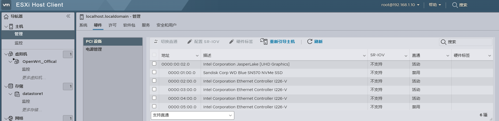
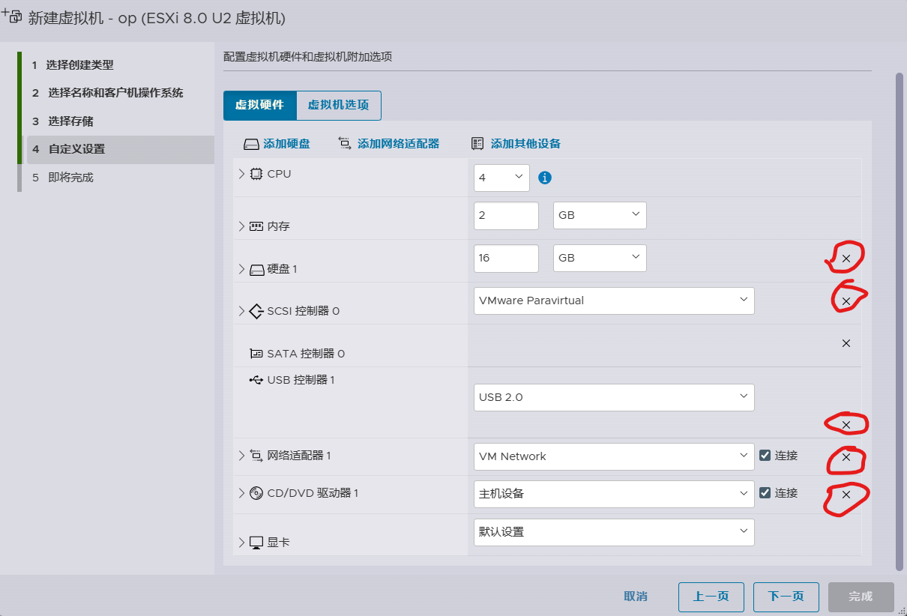
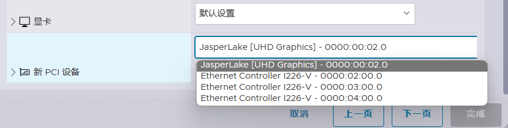
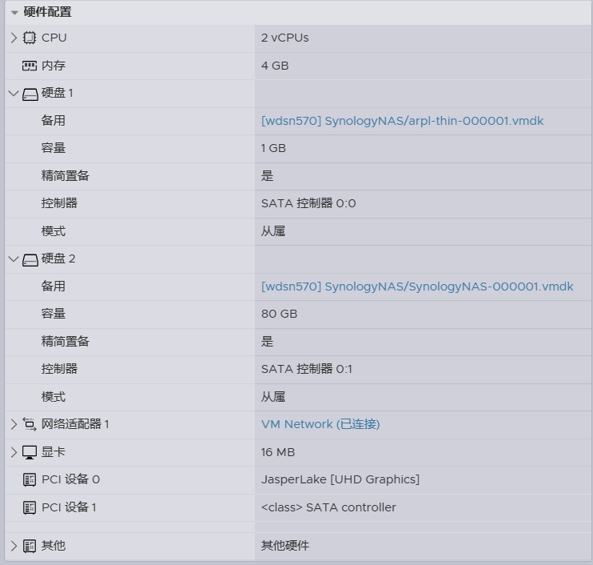
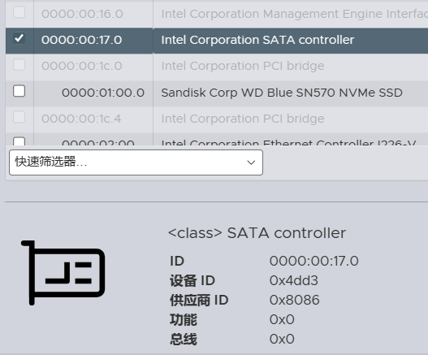
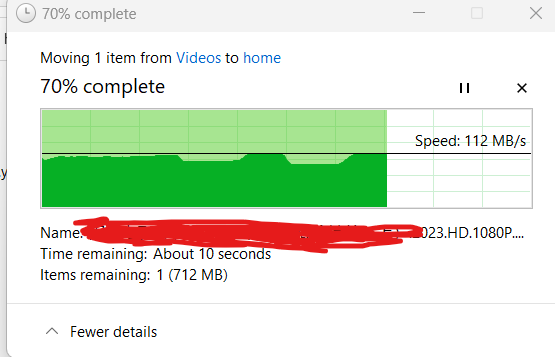
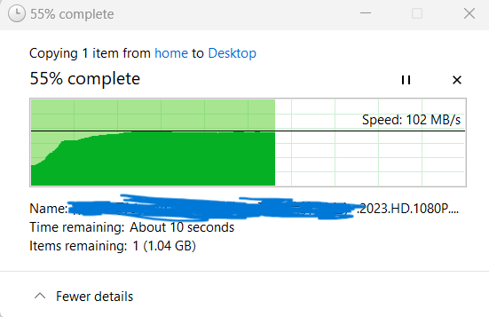

# ESXi 设置选项
## 前情提要
ESXi 8U2 的网卡直通很简单, 直接在  所示 "切换直通" 即可设置.

> **注意**: 假设图中所示四个网卡,其中最后一个作为连接 ESXi 管理界面的网卡, 那么这个网卡不可以设置直通. 会造成无法进入此管理界面, 前三个可正常设置, 意味着直通后交给虚拟机占用.

## 创建 openwrt 虚拟机
如图  所示, 圆圈部分设计的选项均可删除。

如果使用 EFI 引导, 记得在 "虚拟机选项"中 **不要勾选** "启用 UEFI 安全引导"

点击 "添加其他设备-PCI设备" 选择你的网卡 , 这里添加你需要的数量, 比如一个作为 wan 一个作为 lan. 第三个可选择给其他使用.

最后点击下一页并确认, 这时一个 "空壳" 虚拟机就创建好了.

## 创建 vmdk 
下载官方纯净 openwrt 镜像, 例如 "https://downloads.openwrt.org/releases/23.05.0/targets/x86/64/generic-ext4-combined-efi.img.gz" 此为当下时刻的最新镜像.

注意, 官方镜像不提供 iso 格式, 故需要手动创建虚拟机支持虚拟磁盘文件 vmdk,方法:
1. 解压缩 .gz 获得 .img 文件
2. 任意 linux 系统下安装 qemu-img (可能在 sudo apt install qemu-utils 中, 通常情况如果直接安装 sudo apt install qemu-img 会提示找不到, 但大概率会指出其所在软件包)
3. 执行 `qemu-img convert -f raw -O vmdk openwrt-23.05.0-x86-64-generic-ext4-combined-efi.img openwrt-23.05.0-x86-64-generic-ext4-combined-efi.vmdk` 将生成 vmdk 文件
4. 利用 scp 或者 ESXi 中的 `存储-数据存储浏览器-上载` 复制 vmdk 到你选择的位置
5. 回到 ESXi 虚拟机中, 如图所示  在 "现有硬盘" 中找到 vmdk 文件并选定. 点击保存.
6. 默认的虚拟磁盘文件通常很小, 此时在回到 "编辑设置" 中在 "硬盘1" 位置重新输入一个大小作为 openwrt 虚拟机的大小, 比如 8G,16G,甚至更大.
7. 虚拟机部分已全部安装完成, 启动系统.
8. **重要**, 如果在安装启动虚拟过程中遇到类似 `Unsupported or invalid disk type 2 for 'scsi0:0'` 错误, 那是因为默认情况你的 vmdk 的 "磁盘置备" 为 "厚置备" (可在 "编辑设置" 中查看),(仅作示例)

    需要将其改为精简置备, 此时不能手动更改, 需要通过 ssh 进入命令行更改
9. 进入 ssh
   
   运行
   - `cd /vmfs/volumes/datastore1/`
   - `vmkfstools -i openwrt-23.05.0-x86-64-
generic-ext4-combined-efi.vmdk openwrt-23.05.0-x86-64-generic-ext4-combined-efi-thin.vmdk -d thin` (命令中的文件名称换成你自己文件的名称即可.)
10. 此时, 在  中选择 **新生成** 的 `openwrt-23.05.0-x86-64-generic-ext4-combined-efi-thin.vmdk` 注意不要误选成原来的 vmdk.(原来的 vmdk 可删除或者留着备份都可)
11. 此时启动虚拟机, 可正常运行, 虚拟机部分就算大功告成.

## 创建 NAS 虚拟机
> 黑群晖 引导方法 [From wjz304](https://github.com/wjz304/arpl-i18n)

wjz304 提供的是 img 镜像文件, 同样需要转化为 xx-thin.vmdk 才能再 ESXi中正确引导. 方法和上述相同.

虚拟机的设置参考如图:

重要:
- 值得注意的是, 这里的引导需要单独位于 `sata 0:0` 的位置
- 数据盘需要单独创建, 此处暂时使用虚拟 sata, 注意位置为 `sata 0:1`
- PCI 设置中, 添加了 SATA controller 将自带的sata控制器直通以便扩展另加的 sata 硬盘给 NAS. 方法在下.

### SATA controller 直通
> 参考 互联网

正常情况, 再 ESXi 的直通列表里, `0000:00:17:0 Intel Corporation SATA controller` 是灰色状态, 意味着这里不支持直接切换直通. 但再下方可以看到设备的信息,如图 
记录下 设备ID 和 供应商ID.

随后 ssh 进入 ESXi 命令行界面, 进入目录 `/etc/vmware/` 找到其中的 `passthru.map` 使用 vi 打开编辑, 在末尾添加如下 `8086  4dd3  d3d0     default` 前两个对应 供应商ID 和 设备 ID, 其他代表含义可在本文件中自行查看. 保存退出, 重启机器, 此时再回到直通列表界面, 发现其可被选择, 这时切换其为活动即可.

> 题外话: 实测笔记本千兆网卡和 NAS 互传电源速度.

笔记本 ---> NAS

NAS ---> 笔记本 

> 极轻度依赖 NAS, 凑合用还可以.xD

### 添加 USB 直通也同理
>略

### 重要: 显卡直通
> 虽然显卡可以直接在 ESXi 切换直通且显示 "活动", 但每次重启后, 会发现显卡直通显示 "已启用/需要重新引导"

解决方法: 禁用 ESXi 使用核显

进入 SSH 输入命令 `esxcli system settings kernel set -s vga -v FALSE`

恢复命令 `esxcli system settings kernel set -s vga -v TRUE`
