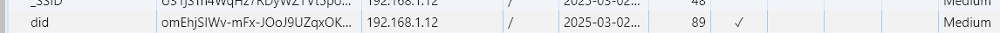

# NAS 的一些设置

## ~~重要: 显卡直通~~(过时)
> ~~修改 ig15.ko 文件~~
> 
> ~~参考 [集显驱动测试](https://imnks.com/6421.html) 最后 ls /dev/dri 显示了内容, 但实际上在 synology photo 中启动 "人物" 主题识别仍然不能进行,或者只能有几个识别,具体还不知道哪里出了问题. 硬解成不成功还未测试.~~(过时)


## 最新引导
**更新**
参考引导 rr 23.11.x 系列, 在安装引导时使用产品 sa6400 即可默认启用 NAS 中的硬件解码.(至少 11代, 12代应该是可以的)

**提示**: 在引导下载过程中有一个不小的"坑", 关于 DSM 的下载区域问题。即使使用了代理, 且在安装引导过程中获得了 DSM 的地址为非 cn 区域, 比如 "global.synologydownload.com". 在真正下载的时候, 脚本仍会进行比较判断当前 ip 使用哪个下载区域最优, 这时问题来了, 如果你的代理非全局, 那么脚本中包含的 cn 区域会被检测为 "最优", 从而进行直连, 然后它就会进入无休止的下载失败循环。

解决方法: 
1. 手动修改脚本(适用于使用代理网络)
通过命令行界面, 进入到执行下载的脚本中(~~忘记了名字~~), 搜索关于下载的关键字,比如使用 cn 区域的 "cndl.synology.cn", 找到它并在判断最优的代码中删除此地址和相关逻辑. 
2. 其他. 比如直连(~~直连一直失败, 不然也不会出现上述"问题"~~),不同地区可自行测试. 或者代理全局下载(自行测试)

## 群晖中查看硬盘 SMART 信息
进入 ssh, sudo -i 切换 root, 运行 `fdisk -l` 查看你的硬盘设备名称,然后 `smartctl -a -d sat /dev/your_sata_device`


## VideoStation
支持 DTS, EAC3 and TrueHD. 参考 [VideoStation-FFMPEG-Patcher](https://github.com/AlexPresso/VideoStation-FFMPEG-Patcher).

添加第三方源 SynoCommunity 时, 如果遇到错误可能的原因是证书配置问题.


## 重要: acme.sh 自动配置证书

### 配置镜像
使用 docker image: neilpang/acme.sh:latest 镜像.

并安装图中所示填写信息, 需要格外注意引号是否添加错误.


注意: 
1. `SYNO_Device_Name` 随意
2. `SYNO_Deivce_ID` 是在网页通过双重验证并勾选信任此设备后的 cookie key=did 的值.


### 注册
容器启动后, 打开 synology 的 ssh, 进入命令行运行以下命令:

```sh
# 注册账户, 默认 zerossl
sudo docker exec acme.sh --register-account -m xxx@youremail.com

# 使用 dns_api 注册证书 (其他 api 可参考官网教程)
sudo docker exec acme.sh --issue --dns dns_cf -d example.com -d '*.example.com' --home /acme.sh

# 使用 synology_dsm 部署证书到 synology
sudo docker exec acme.sh --deploy -d example.com --deploy-hook synology_dsm --insecure --home /acme.sh

# 可选, 启用自动更新
sudo docker exec acme.sh --upgrade --auto-upgrade

### 可选, renew
sudo docker exec acme.sh --cron --home /root/.acme.sh --config-home /acme.sh # (--force 强制 renew)    
```

## 流媒体硬解解锁(可选)
举例: emby, jellyfin 等
在使用 docker 创建容器时, NAS 自带的 Container 无法设置 --dev 参数, 故在需要硬件解码时, 需要自行进入 NAS ssh 命令行, 使用命令 `sudo docker create --network=host --name=emby --device /dev/dri:/dev/dri emby/embyserver:latest` 手动创建容器(注意,这里确定网络使用 host 还是 bridge, 因为容器创建后不可更改其 network), 然后回到图形界面中, 再次设置其他选项, 比如映射文件, 映射端口等