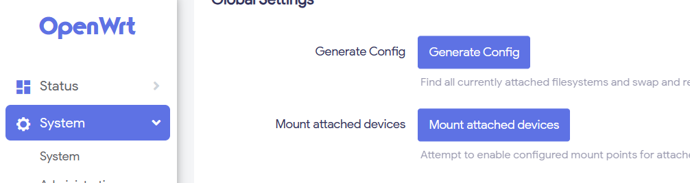
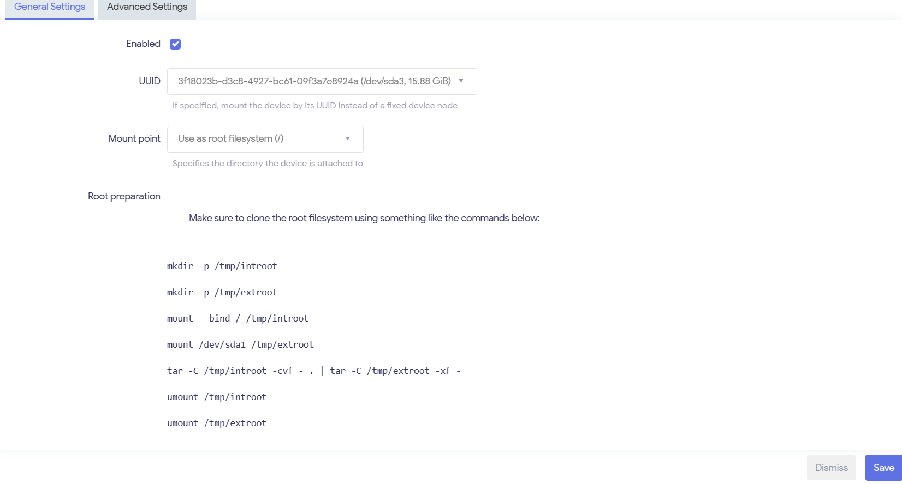
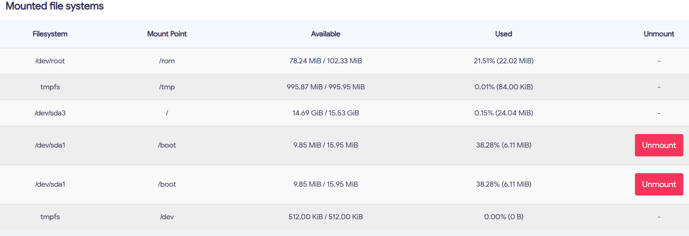

# Openwrt 设置
## 首次进入系统
设置 brd-lan ip 地址

- `vi /etc/config/network`

  找到 br-lan 部分, 改成你可访问的地址, 例如 192.168.1.10 不与默认的 192.168.1.1 冲突但在同一个子网.
## 进入 openwrt 管理页面
> 个人的一些插件, 可忽略此部分
- 修改源, 比如

```
src/gz openwrt_core https://mirrors.cloud.tencent.com/openwrt/releases/23.05.0/targets/x86/64/packages
src/gz openwrt_base https://mirrors.cloud.tencent.com/openwrt/releases/23.05.0/packages/x86_64/base
src/gz openwrt_luci https://mirrors.cloud.tencent.com/openwrt/releases/23.05.0/packages/x86_64/luci
src/gz openwrt_packages https://mirrors.cloud.tencent.com/openwrt/releases/23.05.0/packages/x86_64/packages
src/gz openwrt_routing https://mirrors.cloud.tencent.com/openwrt/releases/23.05.0/packages/x86_64/routing
src/gz openwrt_telephony https://mirrors.cloud.tencent.com/openwrt/releases/23.05.0/packages/x86_64/telephony
```

- 主题, 比如 luci-app-argon
- others

## 重要: 扩容
进入系统会发现自动分配的根目录很少只有百M级别,会让人恐慌.所以扩容刻不容缓.

1. 准备工具

默认的系统相关软件工具并未安装,例如 fdisk, mount points
- fdisk 可在 System-Software 的软件源中查找, 然后点击 install 即可
- mount points(挂载点) 经查阅[官网文档](https://openwrt.org/docs/guide-user/storage/fstab), 现如下步骤(不考虑 usb 存储介质, 可自行查阅官方)
  1. opkg update
  2. opkg install block-mount
  3. block detect > /etc/config/fstab
  4. service fstab enable

此时, "Mount Points"(挂载点)会出现在 System 设置中

2. 挂载剩余的空间

假设在虚拟机中分配了 16G 大小. 那么此时你运行 `fdisk -l`
```
Disk model: VMware Virtual S
Units: sectors of 1 * 512 = 512 bytes
Sector size (logical/physical): 512 bytes / 512 bytes
I/O size (minimum/optimal): 512 bytes / 512 bytes
Disklabel type: gpt
Disk identifier: 0BF605D0-65DD-058C-3548-B83D11220200

Device       Start      End  Sectors  Size Type
/dev/sda1      512    33279    32768   16M Linux filesystem
/dev/sda2    33280   246271   212992  104M Linux filesystem
/dev/sda128     34      511      478  239K BIOS boot
```
会发现远远不够 16G, 还有许多空间并未挂载. 故使用 fdisk 扩充磁盘
- fdisk /dev/sda
- 进入磁盘管理命令行, 按 "n" add a new partition, 一路确认则创建好 /dev/sda3
- 按 "w" 保存并退出

此时磁盘分区如下
```
Disk /dev/sda: 16 GiB, 17179869184 bytes, 33554432 sectors
Disk model: VMware Virtual S
Units: sectors of 1 * 512 = 512 bytes
Sector size (logical/physical): 512 bytes / 512 bytes
I/O size (minimum/optimal): 512 bytes / 512 bytes
Disklabel type: gpt
Disk identifier: 0BF605D0-65DD-058C-3548-B83D11220200

Device       Start      End  Sectors  Size Type
/dev/sda1      512    33279    32768   16M Linux filesystem
/dev/sda2    33280   246271   212992  104M Linux filesystem
/dev/sda3   247808 33552383 33304576 15.9G Linux filesystem
/dev/sda128     34      511      478  239K BIOS boot
```
3. 创建文件系统
   
   执行命令 `mkfs.ext4 /dev/sda3` 

4. 回到 "Mount Points"(挂载点) 扩容
   - 如图所示, 点击 "Generate Config" 先生成一次设置
   - 再 Add 中添加 /dev/sda3,如图所示  作为根文件系统
   - 此时不要急于保存, 先复制 "Root preparation" 所给予的命令, 然后点击右下角保存并应用。
   - **重要** : 更改命令中的 /dev/sda1 为你刚才创建的分区, 此例中为 /dev/sda3,即修改后的命令如下
      ```bash
      mkdir -p /tmp/introot
      mkdir -p /tmp/extroot
      mount --bind / /tmp/introot
      mount /dev/sda3 /tmp/extroot
      tar -C /tmp/introot -cvf - . | tar -C /tmp/extroot -xf -
      umount /tmp/introot
      umount /tmp/extroot
      ```
      回到 ssh 界面, 复制修改后的命令到 openwrt 虚拟机命令行中依次执行.
    - 重启, 此时整个根目录被扩容, 如图所示 

至此, 容量焦虑暂时得到缓解. 记得在 openwrt 中备份设置, 养成良好的习惯.